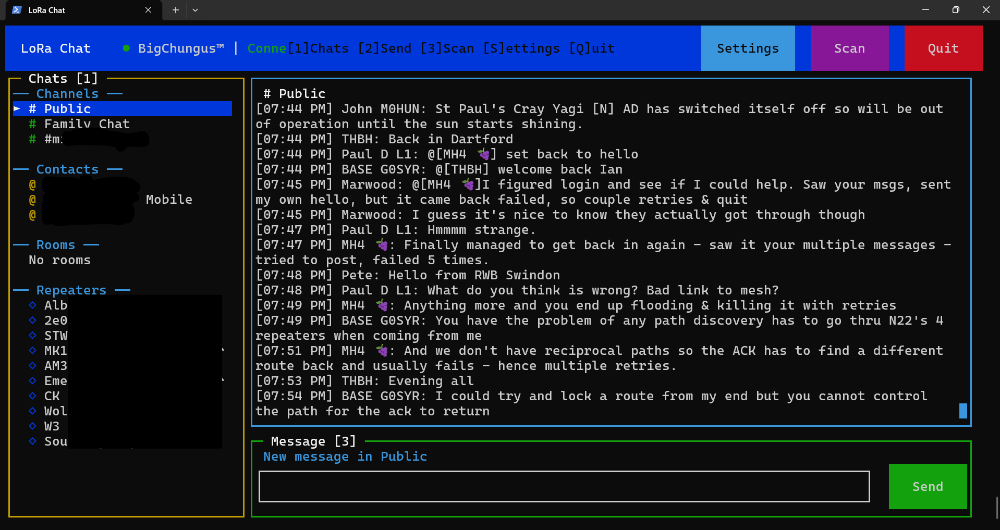

# LoraChat

A terminal-based chat client for MeshCore LoRa mesh networks. Connect to your MeshCore device via Bluetooth LE and chat with contacts, channels, and monitor your mesh network.



## Features

### Chat
- **Channel messaging** - Send and receive messages on public and private channels
- **Direct messages** - Private messaging with contacts
- **Message caching** - Messages persist locally between sessions
- **Unread indicators** - Badge counts for unread messages per chat
- **Delivery confirmations** - Visual status indicators (sending, sent, delivered, failed)
- **Auto-retry** - Failed messages automatically retry up to 3 times

### Device Management
- **BLE Scanner** - Scan for and connect to nearby MeshCore devices
- **Settings Panel** - View device info, telemetry, and connection status
- **Contact list** - View contacts, repeaters, and rooms on your mesh
- **Channel list** - Browse configured channels

### Context Menu
- Right-click on contacts to ping or view info
- Right-click on repeaters to check connectivity
- Right-click on channels to quickly switch

### Telemetry
- Battery voltage monitoring with estimated percentage
- GPS position display (if configured on device)
- Device statistics (contacts, channels, cached messages)

## Requirements

- Node.js 18+
- Windows 10/11 (BLE support via @abandonware/noble)
- A MeshCore-compatible LoRa device with Companion Radio firmware

## Installation

```bash
# Clone the repository
git clone https://github.com/BigChungusTM/LoraChat.git
cd LoraChat

# Install dependencies
npm install

# Run the application
npm start
```

## Usage

### Keyboard Shortcuts

| Key | Action |
|-----|--------|
| `1` | Focus sidebar (chat list) |
| `2` | Focus message input |
| `3` | Open device scanner |
| `S` | Open settings panel |
| `Q` | Quit application |
| `Esc` | Close modal / Return to sidebar |
| `Enter` | Send message (when in input) |

### Mouse Controls

- **Left-click** - Select chats, buttons, menu items
- **Right-click** - Context menu on contacts/channels/repeaters
- **Scroll wheel** - Scroll message list or sidebar

### Connecting to a Device

1. Press `3` or click **Scan** to open the device scanner
2. Wait for your MeshCore device to appear in the list
3. Select your device and press `Enter` to connect
4. Once connected, your contacts and channels will load automatically

### Sending Messages

1. Select a channel or contact from the sidebar
2. Press `2` or click the input area to focus it
3. Type your message (max 200 bytes)
4. Press `Enter` to send

## Building Portable Distribution

Create a standalone portable version with bundled Node.js:

```bash
npm run build
```

This creates a `dist/lorachat/` folder containing:
- `lorachat.bat` - Launch script
- `node.exe` - Bundled Node.js runtime
- `tui.js` - Application code
- `node_modules/` - Dependencies

The portable version can be copied to any Windows machine and run without installing Node.js.

## Configuration

Edit `config.js` to configure:

```javascript
export default {
  connectionType: 'ble',  // 'ble' or 'serial'
  ble: {
    scanTimeout: 30000,   // BLE scan timeout in ms
  },
  pollInterval: 2000,     // Message poll interval in ms
};
```

## Data Files

The application creates these files in its directory:

- `message-cache.json` - Cached messages (persists between sessions)
- `debug.log` - Debug output for troubleshooting

## Dependencies

- [@liamcottle/meshcore.js](https://github.com/liamcottle/meshcore.js) - MeshCore protocol library
- [@abandonware/noble](https://github.com/abandonware/noble) - Bluetooth LE
- [@unblessed/node](https://github.com/unblessed/unblessed) - Terminal UI framework
- [serialport](https://serialport.io/) - Serial port support

## License

ISC

## Acknowledgments

- [MeshCore](https://github.com/ripplebiz/MeshCore) - LoRa mesh networking firmware
- [Liam Cottle](https://github.com/liamcottle) - meshcore.js library
